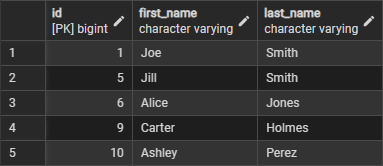

# Project Setup in PostgreSQL - pgAdmin 4

The file included provides instructions to set up data for this project.

File: [_create_customers_table_add_data_](create_customers_table_add_data.sql) 

* Creates a customers table in a database.
* Adds data to the customers table.

Screenshot of customers table:

